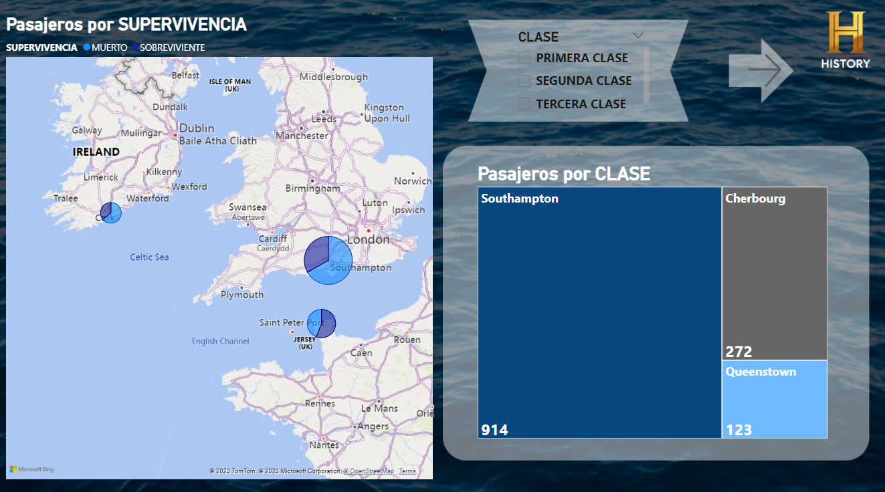

# Informe de los Pasajeros del Titanic

## Explicación

El canal de History nos ha contratado para realizar un documental sobre el Titanic y los factores que influyeron en la sobrevivencia y muerte de sus pasajeros.

Portada Informe

Datos Generales

Por Rango de Edad

Sobrevivencia según el Puerto

Conclusión

